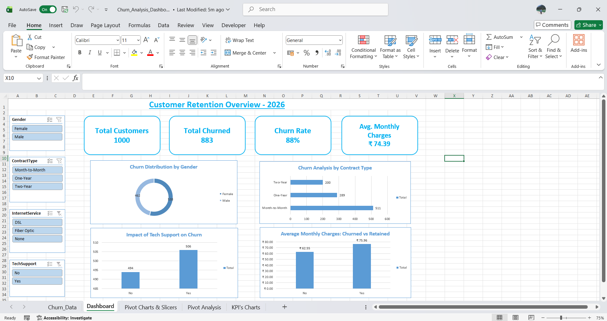

# 📊 Excel Data Analysis & Interactive Dashboard

Is project mein maine raw customer churn dataset ko Excel ka use karke ek interactive dashboard mein convert kiya hai taaki business insights asani se mil saken.

## 🎯 Project Goals
- Data ko clean aur prepare karna.
- Churn risk wale segments ko identify karna.
- Management view ke liye ek interactive dashboard banana.

## 🛠️ Key Steps Performed
1. **Data Cleaning:** Duplicates remove kiye aur data types (Currency, Number) ko sahi kiya.
2. **Feature Engineering:** `AgeGroup` aur `TenureGroup` jaise naye columns banaye.
3. **Pivot Analysis:** Gender, Contract, aur Tech Support ke basis par churn ko analyze kiya.
4. **Dashboard:** KPI cards aur Charts banaye jo Slicers se filter hote hain.

## 📈 Dashboard Highlights
- **Total Customers:** 1000
- **Churn Rate:** 88%
- **Insight:** Month-to-Month contract aur Tech Support na hone ki wajah se log zyada churn ho rahe hain.

## 🖼️ Dashboard Preview

