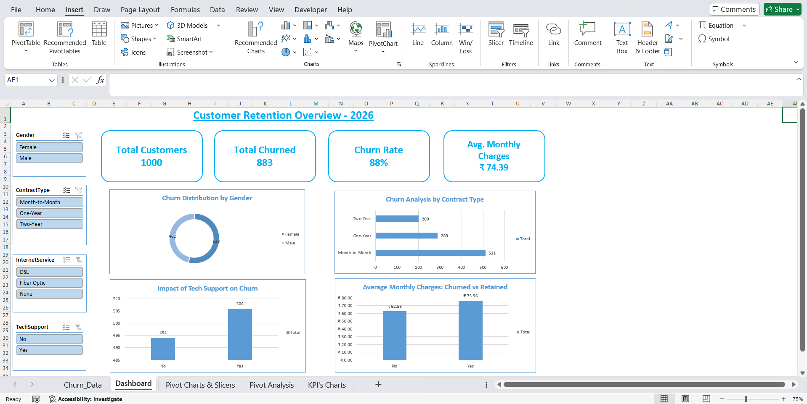

## 📊 Phase 1: Excel Data Analysis & Dashboard
In this initial phase, I focused on transforming raw customer data into a management-ready interactive dashboard. This involved data cleaning, feature engineering, and creating visual insights.

### 🛠️ Key Tasks Performed:
- **Data Cleaning:** Handled missing values, removed duplicates (based on CustomerID), and corrected data types for consistency.
- **Feature Engineering:** Created new segments like `AgeGroup` (Young, Adult, Senior) and `TenureGroup` (New, Medium, Long-Term) to better understand customer behavior.
- **Pivot Analysis:** Built multiple Pivot Tables to analyze churn patterns by Gender, Contract Type, Tech Support, and Internet Service.
- **Interactive Dashboard:** Developed a dynamic dashboard with Slicers for real-time filtering and KPI cards for high-level metrics.

### 📈 Dashboard Highlights:
- **Total Customers:** 1000
- **Churn Rate:** 88% (Based on the analyzed sample)
- **Insight 1:** Customers with **Month-to-Month** contracts have the highest churn risk.
- **Insight 2:** The lack of **Tech Support** is a major driver for customers leaving.
- **Insight 3:** Churned customers often had higher **Monthly Charges** compared to retained ones.

### 🖼️ Dashboard Preview

---
## 📊 Phase 2: SQL Analysis Screenshots
This folder contains screenshots from the SQL analysis phase of the Customer Churn & Retention Analysis project.

The screenshots demonstrate:
- SQL query execution
- Churn analysis
- Customer segmentation
- KPI calculations
- Business insights

---

## 📊 Included Screenshots

## 🔹 Overall Churn Rate
Shows the percentage of customers who churned.

## 🔹 Contract Type Analysis
Analyzes churn behavior based on contract types.

## 🔹 Tech Support Analysis
Shows the impact of tech support on customer churn.

## 🔹 Internet Service Analysis
Displays churn patterns across internet services.

## 🔹 Tenure Group Analysis
Segments customers based on their tenure.

## 🔹 Monthly Charges Analysis
Analyzes churn based on customer monthly charges.

## 🔹 Revenue Analysis
Displays customer revenue metrics.

---

# 📌 Key Findings

- Customers with month-to-month contracts have higher churn rates.
- Customers paying higher monthly charges are more likely to churn.
- Long-term customers show better retention.
- Tech support plays a significant role in customer retention.
